# I. **Use Case Diagram**

# II. **Analysis Diagram**

# III. **Sequence and Class Diagrams**

## Site Info CRU
1. Create Site Info

2. Read Site Info
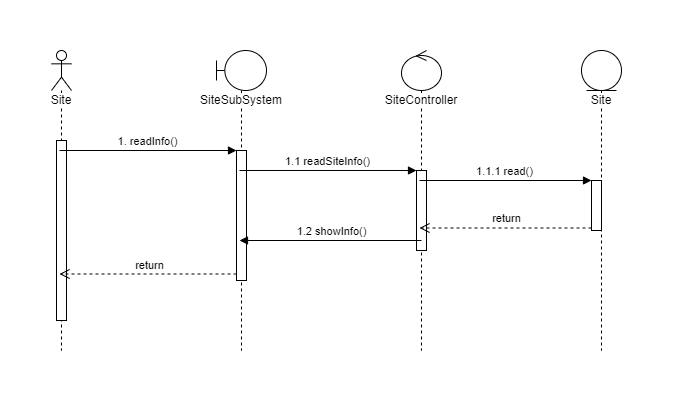
3. Update Site Info

4. Class Diagram

## Merchandise CRU
1. Create Merchandise

2. Read Merchandise

3. Update Merchandise
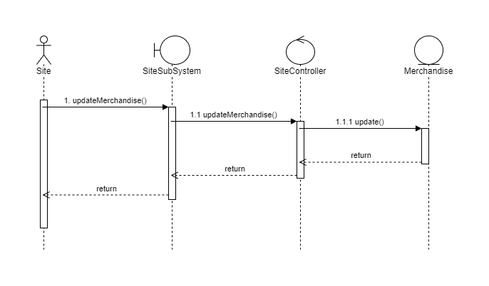
4. Class Diagram

## SaleOrder CRUD
1. Create SaleOrder

2. Read SaleOrder
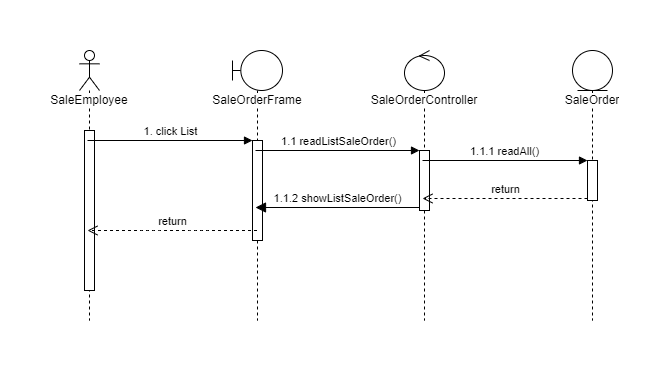
3. Update SaleOrder

4. Delete SaleOrder

5. Class Diagram

## ImportOrder CRUD
1. Create

2. Read by ImportOrderEmployee
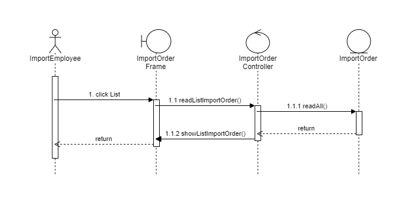
3. Read by WarehouseEmployee
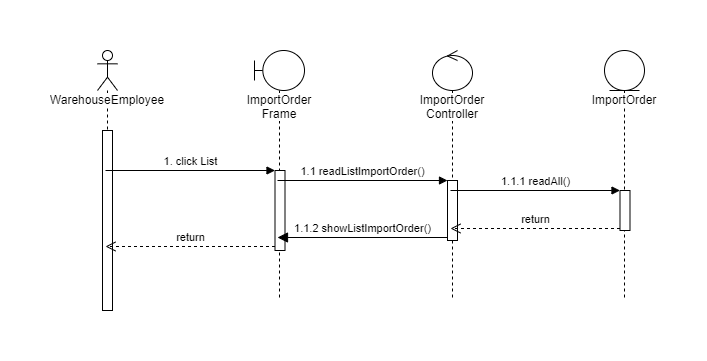
4. Update
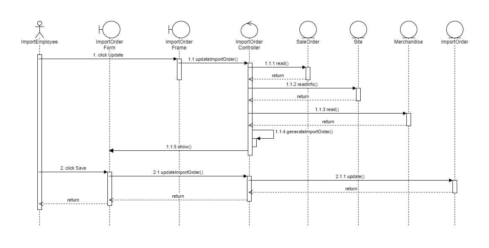
5. Delete
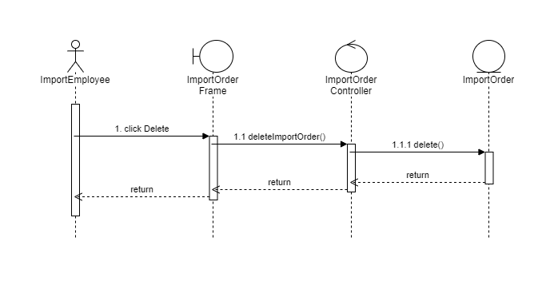
6. Class Diagram
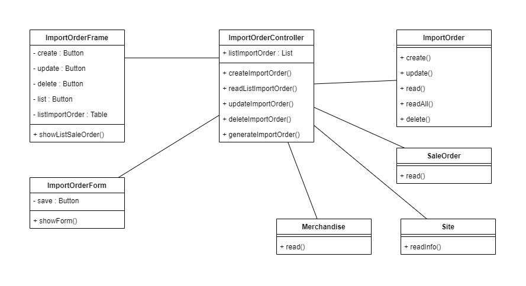

## ImportOrder Send Confirm
1. Send
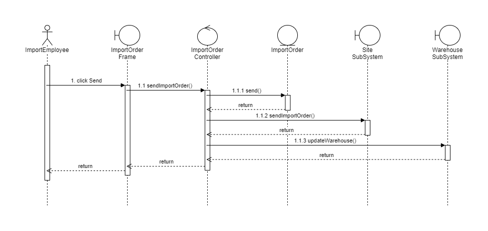
2. Confirm

3. Class Diagram

# IV. Class Design Detail
1. Import Order Class Design - Thiên 
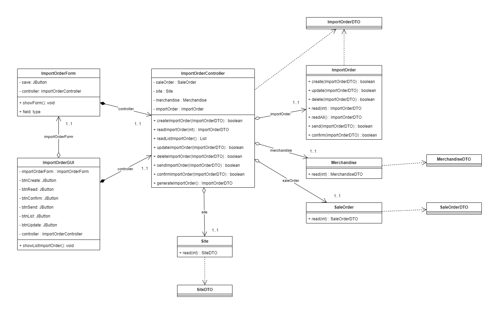

2. Sale Order Class Design - Hải Anh 
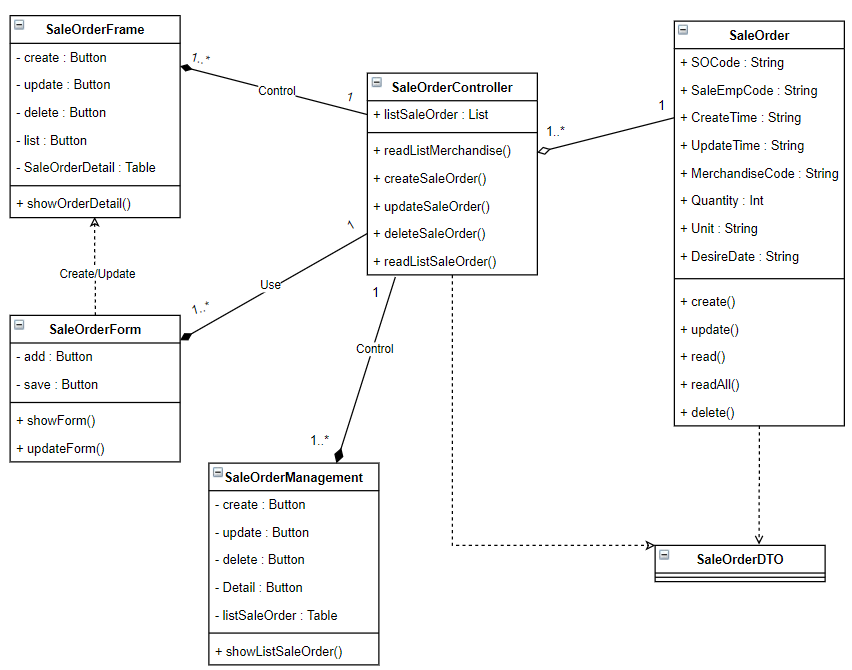

3. Site Info Class Design - Thư 
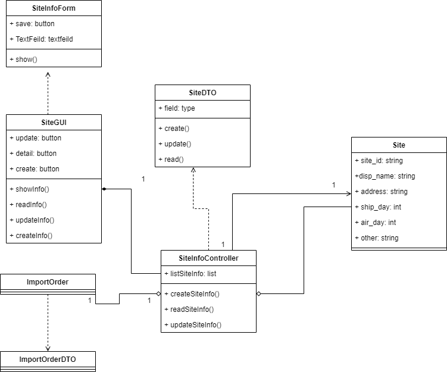

4. Merchandise Class Design - Hồng Quân

# V. UI Flow 
1. Admin 
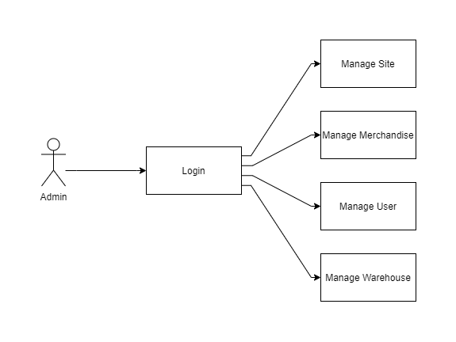
2. Import Order Employee 

3. Sale Order Employee

4. Warehouse Employee

# VI. Database Design 
1. Entity Relationship Diagram

1. Database Model Diagram

