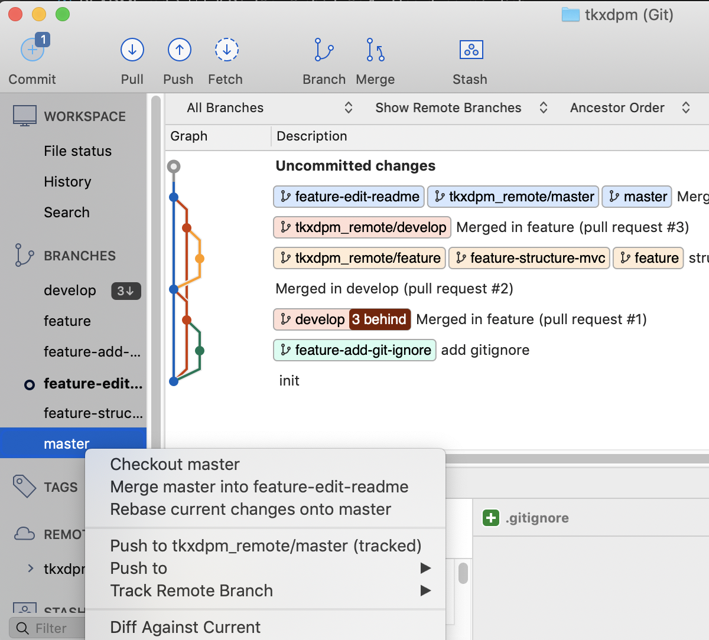
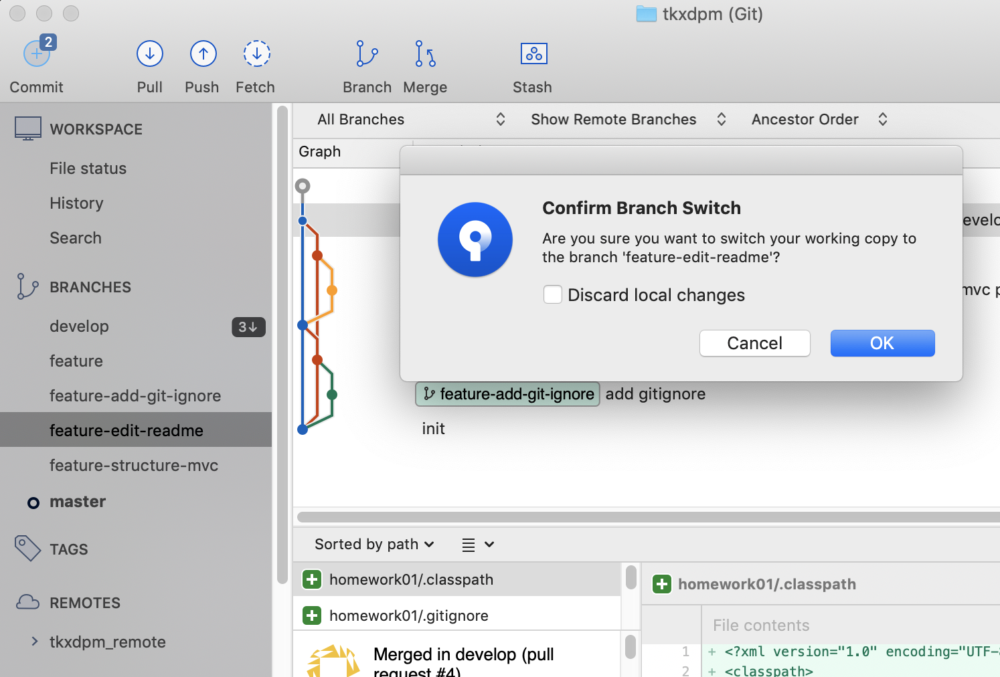
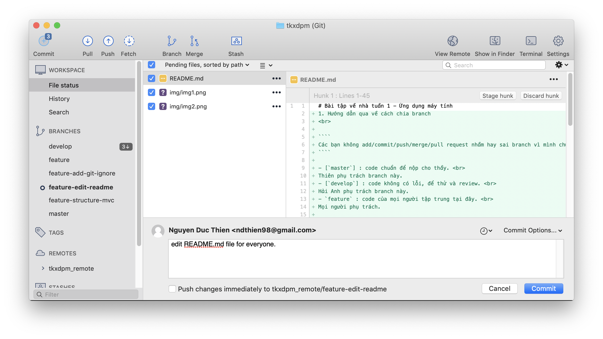
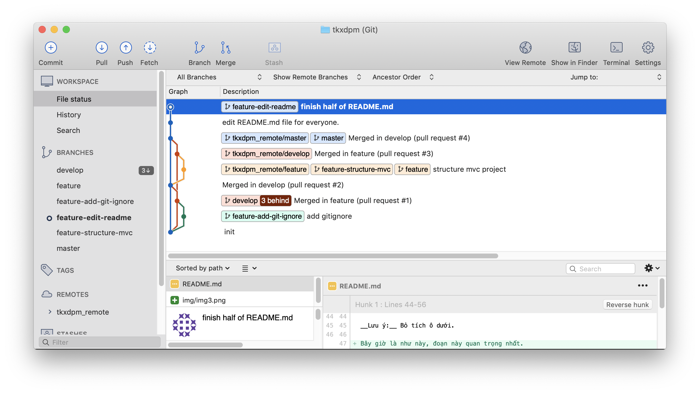
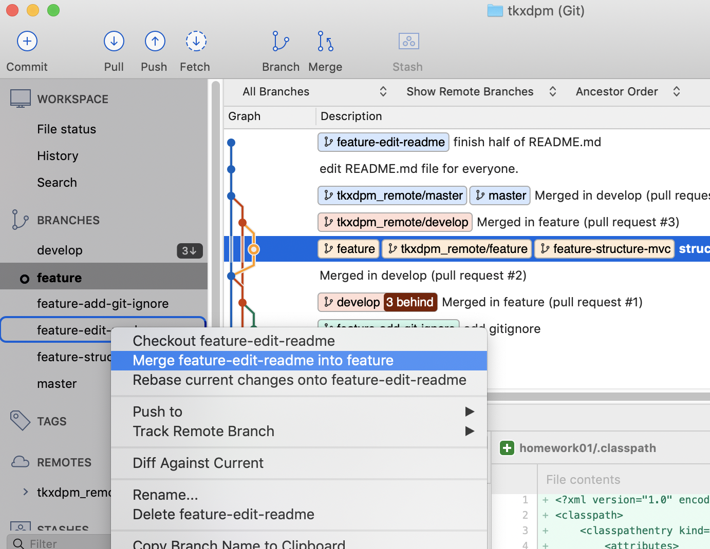
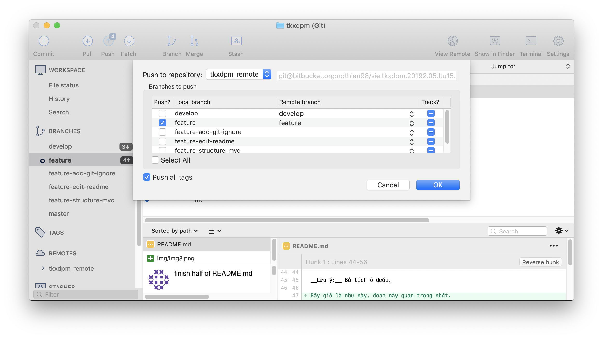
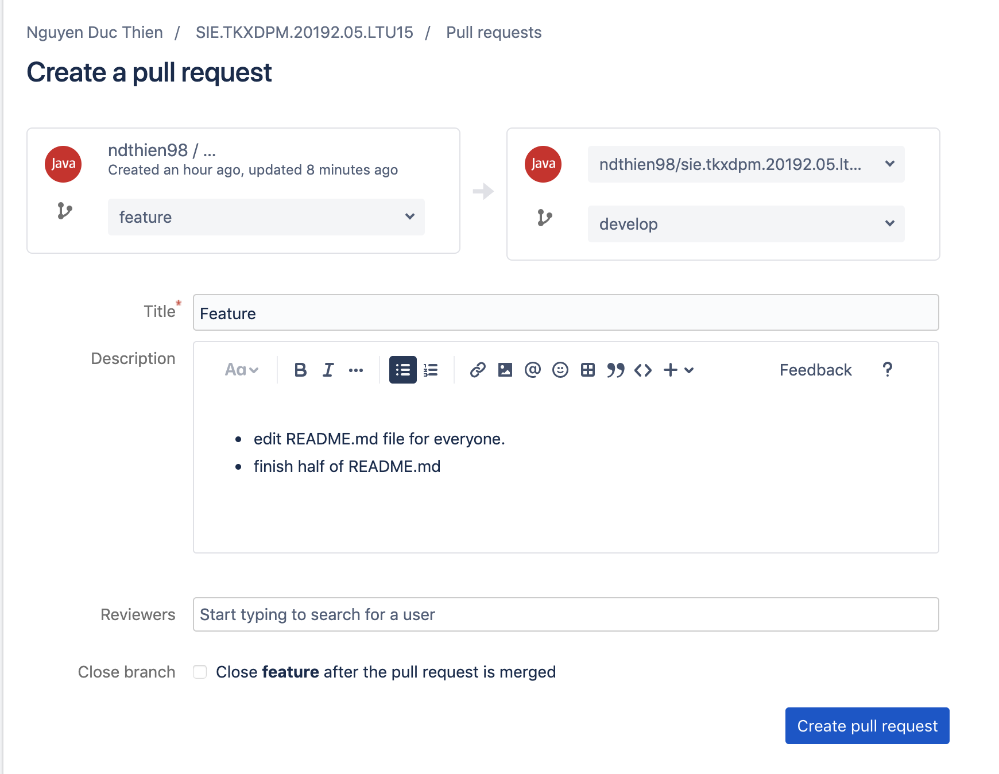

# Bài tập về nhà tuần 1 - Ứng dụng máy tính 
1. Hướng dẫn qua về cách chia branch
<br> 

````
Các bạn không add/commit/push/merge/pull request nhầm hay sai branch vì mình chưa rõ cơ chế phân permission trên Bitbucket. 
````

- [`master`] : code chuẩn để nộp cho thầy. 

Thiên phụ trách branch này. 
- [`develop`] : code không có lỗi, để thử và review. 

Hải Anh phụ trách branch này.
- [`feature`] : code của mọi người tập trung tại đây. 

Mọi người phụ trách. 

2. Làm như nào:
- Đầu tiên thì clone về, ưu tiên dùng [Sourcetree] cho nó dễ. Sau khi tải [Sourcetree] xong thì bấm vào đây 
[SIE.TKXDPM.20192.05.LTU15](sourcetree://cloneRepo?cloneUrl=git%40bitbucket.org%3Andthien98%2Fsie.tkxdpm.20192.05.ltu15.git&type=bitbucket).
- Còn không dùng Sourcetree thì tý xuống có nguyên 1 đoạn làm bằng commandline nhưng không sure lắm nhé. Chưa có thời gian test. 

3. Tải xong thì làm gì ? 

Trước hết là check [Trello] xem phải làm gì. Sau đó checkout 1 branch để làm việc. lưu ý checkout từ feature để tạo feature mới. Trong ảnh là đã tạo 1 branch mới _feature-edit-readme_



Chọn checkout master và tạo 1 branch mới để làm viêc. Khi làm việc chỉ làm việc với branch này. Nhất là commit. __Cực kỳ hạn chế commit nhầm__ branch vì fix nó lằng nhằng + nguy cơ code lại từ đầu cao. 




Sau khi code xong thì double click vào branch mình tạo để chuyển sang. (__tên branch in đậm mới tính__). Nếu báo như trên thì không được tích vào.

Xong rồi bấm commit. Tạo 1 commit. 



__Lưu ý:__ Bỏ tích ô dưới. 

__Bây giờ là như này, đoạn này quan trọng nhất.__

Sau khi commit xong nó như này. 



Double click vào feature chuyển sang đây, Chuột phải vào branch vừa tạo, chọn merge vào feature. 



Như này rồi ấn oke là xong, nó merge cái branch mình vừa tạo để làm việc vào feature. 


Số 3, 4 mũi tên kia là thay đổi. Mũi lên xuống là cần pull từ Bitbucket về, mũi tên lên là cần push lên Bitbucket.

<p align='center'>

</p><br>

__LƯU Ý LẦN NỮA: CHỈ PUSH CODE CỦA 3 BRANCH CHÍNH LÊN BITBUCKET__
[`master`], [`develop`], [`feature`]

Rồi xong rồi. 
Lên tạo [Pull request] nữa là xong. 



Sau đó sẽ là approve và merge code. 

## Chào Hải Anh Dragon.
Công việc của bạn là Merge code của mọi người từ `feature` vào `develop`. Sau đó nếu feature đó ổn, hoặc có lỗi nhỏ thì bạn checkout ra 1 branch khác, fixbug, xong merge lại `feature` và gửi pull request vào `develop`, gắn tag Thiên vào _Reviewers_. 

## Chào Thư.
Công việc của bạn là đọc các pull requets từ `feature` vào `develop` và nếu code ổn, không bị conflict và thấy có thể Merge thì bạn ấn vào Approve

## Thiên làm gì? 
Thiên sẽ check code của Hải Anh đã merge vào `develop`, nếu sai thì sửa và những code ổn định thì Merge vào `master`.

Công việc tạm thời là thế. Nếu có commit nào tên là update README.md hoặc 1 thẻ trong Trello là cập nhập README.md thì vui lòng đọc lại cái README.md hộ tớ. 

## Các bạn làm gì?

Làm ơn về đọc và code thử 1 cái project nhỏ nhỏ bằng MVC.
Bài tập lớn sẽ là code bằng Java Swing, MVC(Model View Control) và 3-tiers (Hình như là Obecj, DTA, DAO).

[Sourcetree]:https://www.sourcetreeapp.com
[Trello]:https://bitbucket.org/ndthien98/sie.tkxdpm.20192.05.ltu15/addon/trello/trello-board
[master]:https://bitbucket.org/ndthien98/sie.tkxdpm.20192.05.ltu15/src/master/
[develop]:https://bitbucket.org/ndthien98/sie.tkxdpm.20192.05.ltu15/src/develop/
[feature]:https://bitbucket.org/ndthien98/sie.tkxdpm.20192.05.ltu15/src/feature/
[Pull request]:https://bitbucket.org/ndthien98/sie.tkxdpm.20192.05.ltu15/pull-requests/new
